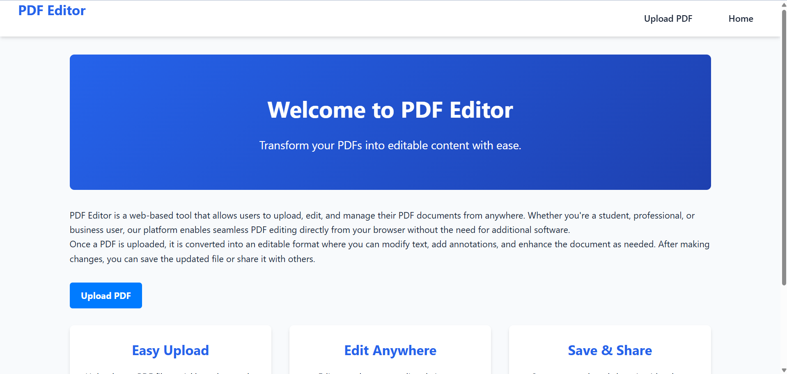
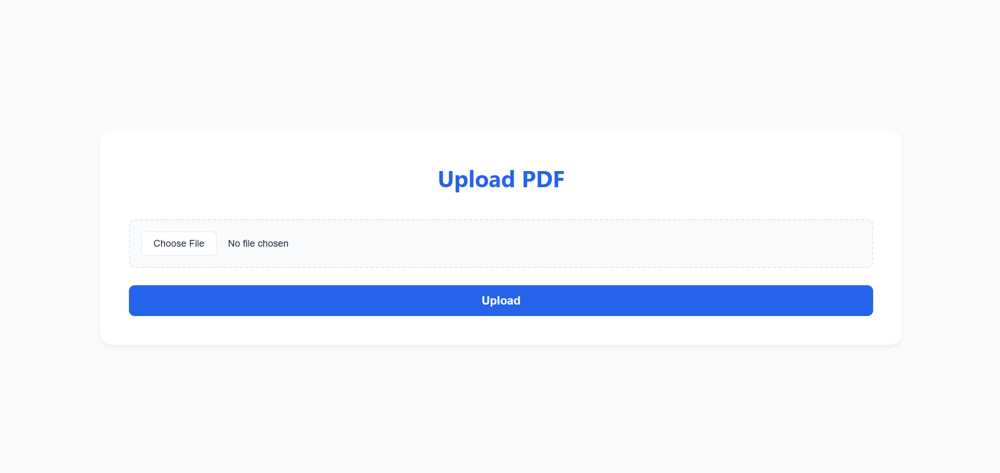
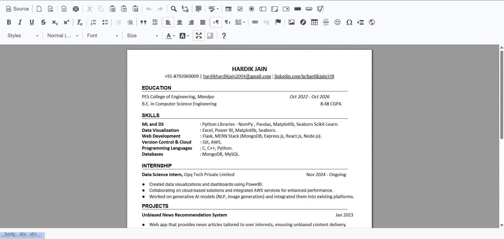
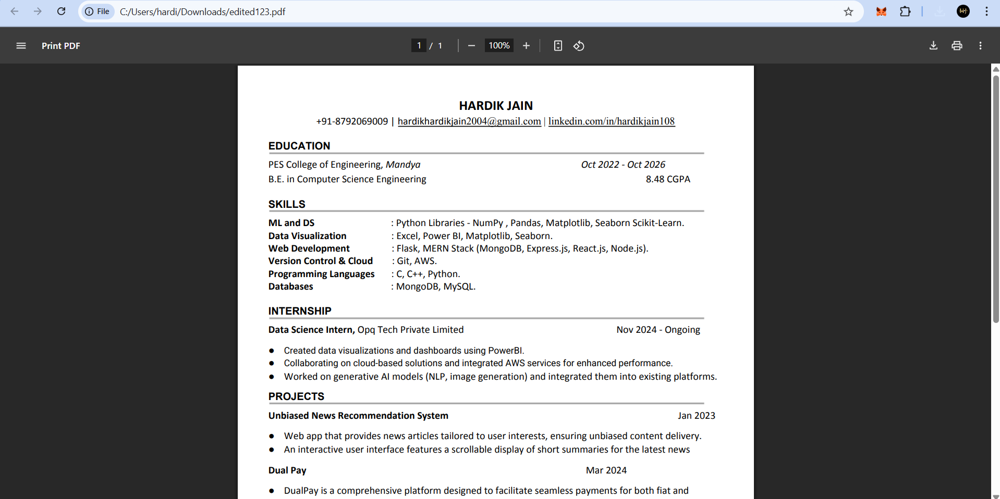

# PDF EDITOR

*Transform PDF documents into editable web content and back to PDF seamlessly*

## 📌 Overview
A web application that enables users to upload a PDF, edit it using a modern online editor, and download the modified file as a PDF.

# Demo Video*
<div align="center">
  <video width="100%" controls>
    <source src="screenshots/demo.mp4" type="video/mp4">
  </video>

  <p><i>Can't see the video? <a href="https://www.youtube.com/watch?v=W5RSCbVLR7Y">Watch it on YouTube</a></i></p>
</div>

---

## 🚀 Features
- 📤 PDF Upload & Conversion
- ✏️ In-browser Editing with CKEditor
- 💾 Export Edited Content to PDF
- 🎨 Format Preservation (Layout/Fonts/Images)
- 📱 Responsive Design

---

## 🛠 Tech Stack
| Component          | Technology       |
|---------------------|------------------|
| **Backend Framework** | Flask (Python)   |
| **PDF Processing**    | pdf2htmlEX       |
| **Rich Text Editor**  | CKEditor 4       |
| **PDF Export**        | WeasyPrint       |
| **Frontend**          | HTML5/CSS3/JS    |

---

## 📸 Screenshots

### 1. Home Page - Overview
  
*Home page explaining the website purpose*

### 1. Upload Page - PDF Upload
  
*Simple interface for PDF upload*

### 2. Web Editor Interface
  
*Rich text editing with preserved PDF formatting using CKEditor*

### 3. Exported PDF Preview
  
*Final exported PDF maintains original layout and styling*

---

## 🗂 Project Structure
```bash
pdf-web-editor/
├── app/
│   ├── __init__.py
│   ├── routes.py
│   ├── static/
│   │   ├── css/
│   │   └── js/
│   ├── templates/
│   │   ├── base.html
│   │   ├── index.html
│   │   └── editor.html
│   └── utils/
│       └── pdf_utils.py
├── venv/
├── requirements.txt
├── config.py
├── screenshots/
│   ├── home.png
│   ├── editor.png
│   └── export.png
└── README.md
```

# Installation Guide

Follow these steps to set up the **PDF to Web Editor** project on your local machine.

---

## Prerequisites

Before starting, ensure you have the following installed:

- **Python 3.8+**
- **pdf2htmlEX** (for PDF-to-HTML conversion)
- **Git** (for cloning the repository)

---

## Step 1: Clone the Repository

1. Open your terminal or command prompt.
2. Run the following command to clone the repository:

   ```bash
   https://github.com/hardikkaaccount/pdfeditor.git
   ```

3. Navigate to the project directory:

   ```bash
   cd pdfeditor
   ```
4. Update CKEditor Licence Key in /templates/editor.html

---

## Step 2: Set Up Virtual Environment

1. Create a virtual environment:

   ```bash
   python -m venv venv
   ```

2. Activate the virtual environment:
   - **Windows**:
     ```bash
     venv\Scripts\activate
     ```
   - **macOS/Linux**:
     ```bash
     source venv/bin/activate
     ```

---

## Step 3: Install Dependencies

1. Install the required Python packages:

   ```bash
   pip install -r requirements.txt
   ```

2. Install **pdf2htmlEX**:
   - Already installed in folder, no need to install externally

---

## Step 4: Configure Environment Variables

1. Powershell

   ```plaintext
   $env:FLASK_APP = "app"
 
   ```
2. Command Prompt

   ```plaintext
   set FLASK_APP=app

   ```
---

## Step 5: Run the Application

1. Start the Flask development server:

   ```bash
   flask run
   ```

2. Open your browser and navigate to:

   ```
   http://localhost:5000
   (or)
   http://127.0.0.1:5000
   ```
  

---

## Next Steps
- Upload a PDF file to test the editor.
- Edit the content and export it back to PDF.

---

**For further assistance, contact:**  
Hardik Jain, AI &ML Departmen, PESCE Mandya  
📧 [hardikhardikjain2004@gmail.com](mailto:hardikhardikjain2004@gmail.com)
```

